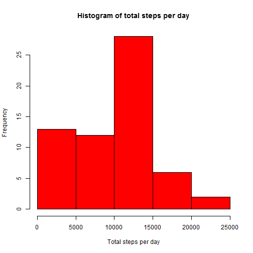
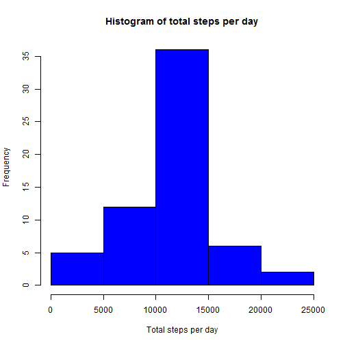
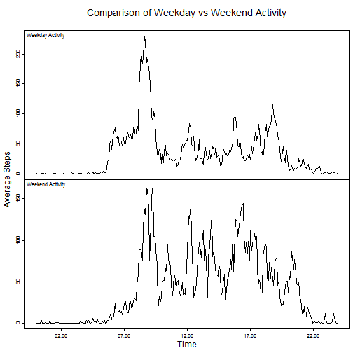

## Loading and preprocessing the data
After forking the project from https://github.com/rdpeng/RepData_PeerAssessment1, I cloned it onto my local machine, and unzipped activity.zip outside R codes, resulting in activity.csv in the same folder. I then created a new R Studio project in this directory.

We first read in the file into a data frame called "activity":

```r
activity <- read.csv("activity.csv")
```

## Q1: What is mean total number of steps taken per day?

For this question, we need to split the data frame by date, and applied sum over the data by date. For statistical calculation, we converted the list to a vector of numerics.

```r
activity <- read.csv("activity.csv")
byDate <- with(activity, split(steps, date))
totalEveryday <- lapply(byDate, sum, na.rm=TRUE)
totalEverydayVector <-as.numeric(totalEveryday)
```

Then the mean is 

```r
mean(totalEverydayVector)
```

```
## [1] 9354.23
```

and the median is 

```r
median(totalEverydayVector)
```

```
## [1] 10395
```

The following histogram shows that the individual is quite active, and walked between 10K and 15K steps most of days There are days the person is laid back and walked less than 5K steps, but in some days, (s)he can reach over 20K steps.

 

## Q2: What is the average daily activity pattern?

To find the average daily activity pattern, we have to split the data frame by interval, and apply the mean function. Since the original interval identifiers are of different lengths, we used str_pad fuction to format them to 4 characters long, prepending with 0 when necessary. Then we transformed labels to Date class, and made a time series plot.

```r
byInterval <- with(activity, split(steps, interval))
meanByInterval <- lapply(byInterval, mean, na.rm=TRUE)
library(stringr)
labels <- str_pad(names(meanByInterval), 4, pad = "0")
labels <- strptime(labels, format="%H%M")
avgByInterval <- as.numeric(meanByInterval)
plot(x=labels, y=avgByInterval, type="l", xlab = "Time in a Day"
     , ylab = "Average steps", main = "Average steps per 5 min interval")
```

 

with the maximum number of 

```r
sprintf("%.0f", avgByInterval[which.max(avgByInterval)])
```

```
## [1] "206"
```
steps at 

```r
format(labels[which.max(avgByInterval)], "%H:%M")
```

```
## [1] "08:35"
```

Quite early in the morning. It looks like this is an early morning person, and do most walking between 8am and 10am. There are also more walking around lunch and dinner time.

## Q3: Imputting Missing Values

Browsing over "activity" data frame, we can see a lot of missing values for the steps. The number of records missing "steps" field is

```r
sum(is.na(activity$steps))
```

```
## [1] 2304
```
about 13% of the data set. 

What values should we replace those NAs with? I think it is quite reasonable to use the mean for that 5-minute interval from Q2. We created new data frame "fullActivity" from "activity", and then replace NAs with the mean for the corresponding 5-minute interval.

```r
fullActivity <- activity
for (i in 1:nrow(fullActivity)) {
  if (is.na(fullActivity[i, "steps"]))
    fullActivity[i, "steps"] <- meanByInterval[[as.character(fullActivity[i, "interval"])]]
}
```

Then we can repeat what we did in Q1, but using the new "fullActivity"

```r
byDate <- with(fullActivity, split(steps, date))
totalEveryday <- lapply(byDate, sum, na.rm=TRUE)
totalEverydayVector <-as.numeric(totalEveryday)
```
The new mean is 

```r
mean(totalEverydayVector)
```

```
## [1] 10766.19
```

and the new median is 

```r
median(totalEverydayVector)
```

```
## [1] 10766.19
```

The new histogram looks like

 

Since we filled in about 13% of missing fields, theincrease in the average number of total steps per day should also be about the same. Comparing 10766 vs 9354, it is about 15% increase, not far from the 13%.

Since the average is from 9354 to 10766, most of the increases should be around this area. We can see the number of occurances between 10K to 15K jumped more significantly, also quite noticiable drop between 0K and 5K. This implied that the missing data caused overcalculation on the lower end, which is reasonable. The number of occurances for other 3 brackets did not change that much.

## Q4: Are there differences in activity patterns between weekdays and weekends?
To answer this, we have to separate weekday and weekend activities like following:

```r
fullActivity$dayOfWeek <- as.factor(weekdays(strptime(fullActivity$date, format="%Y-%m-%d")))
for (i in 1:nrow(fullActivity)) {
  if (fullActivity[i, "dayOfWeek"] %in% c('Saturday', 'Sunday'))
    fullActivity[i, "dayType"] <- 'weekend'
  else
    fullActivity[i, "dayType"] <- 'weekday'
}
weekday <- subset(fullActivity, dayType == 'weekday')
weekend <- subset(fullActivity, dayType == 'weekend')
```
Repeating what we did in Q2, by replacing "activity" with "weekday" or "weekend", respectively

```r
byIntervalWkdy <- with(weekday, split(steps, interval))
meanByIntervalWkdy <- lapply(byIntervalWkdy, mean, na.rm=TRUE)
labelsWkdy <- str_pad(names(meanByIntervalWkdy), 4, pad = "0")
labelsWkdy <- strptime(labelsWkdy, format="%H%M")
avgByIntervalWkdy <- as.numeric(meanByIntervalWkdy)

byIntervalWkd <- with(weekend, split(steps, interval))
meanByIntervalWkd <- lapply(byIntervalWkd, mean, na.rm=TRUE)
labelsWkd <- str_pad(names(meanByIntervalWkd), 4, pad = "0")
labelsWkd <- strptime(labelsWkd, format="%H%M")
avgByIntervalWkd <- as.numeric(meanByIntervalWkd)
```

Then we use the R base package to make a panel plot comparing the weekday and weekend activities.

```r
par(mfrow = c(2, 1))
par(cex = 0.6)
par(mar = c(0,0,0,0), oma=c(4, 4, 5, 0.5))
par(tcl = -0.25)
par(mgp = c(2, 0.6, 0))
plot(x=labelsWkdy, y=avgByIntervalWkdy, type = "l", axes = FALSE)
mtext("Weekday Activity", side = 3, cex = 0.7, line = -1.3, adj = 0.01)
axis(2)
box()
plot(x=labelsWkd, y=avgByIntervalWkd, type = "l")
mtext("Weekend Activity", side = 3, cex = 0.7, line = -1.3, adj = 0.01)

mtext("Time", side = 1, outer = TRUE, cex = 1, line = 2.2)
mtext("Average Steps", side = 2, outer = TRUE, cex = 1, line = 2.2)
mtext("Comparison of Weekday vs Weekend Activity", side = 3, outer = TRUE, cex = 1.2, line = 2.2)
```

 

We can see obvious differences. In weekdays, the person usually gets up earlier, and does most exercise in the morning, and do other works for the rest of the day. In weekends, this person gets up later, and then spread his/her activities more evenly throughout a day.
